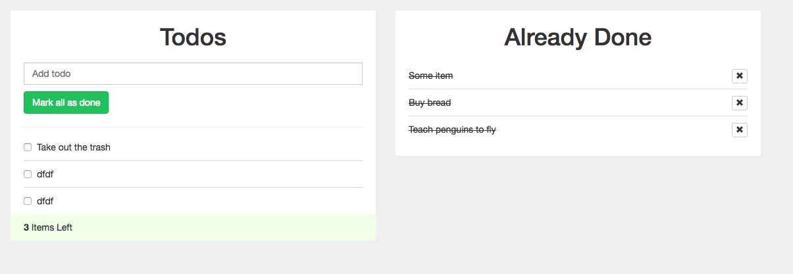

# TO-DO List w/ React

Create a Todo List with React using the one at [https://bootsnipp.com/snippets/featured/todo-example](https://bootsnipp.com/snippets/featured/todo-example) as a reference

The TODO List should allow us to:

- View Pending Tasks
- View Completed Tasks
- Add Task
- Mark Task as completed
- Remove Task from Completes